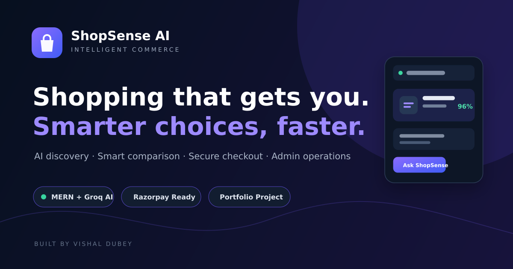
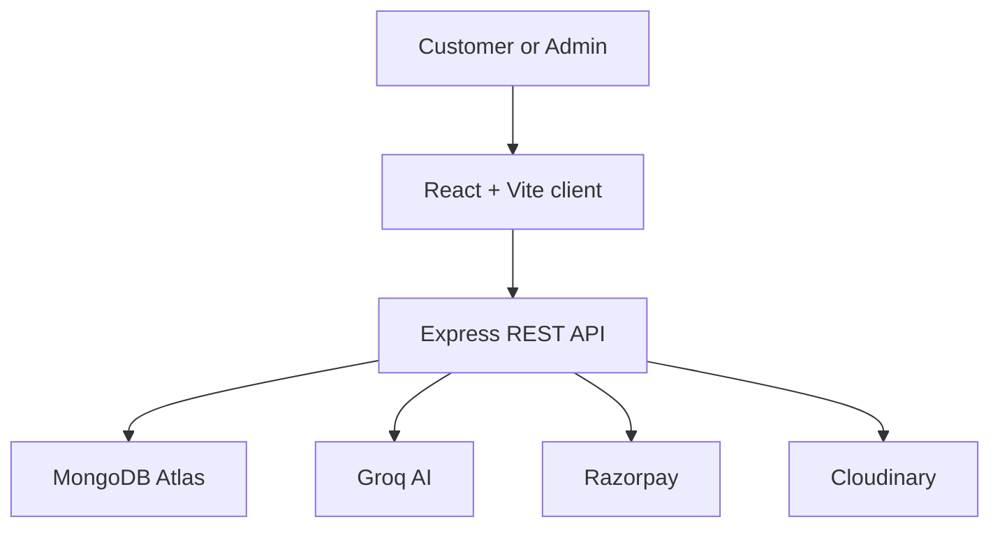

# ShopSense AI

<div align="center">
  

  **An AI-assisted commerce platform that turns natural-language intent into confident product decisions.**

  [](https://shopsense-ai-vishal.netlify.app)
  [](https://shopsense-ai-6ge1.onrender.com/api/health)
  [](#technology-stack)
</div>

## Overview

ShopSense AI is a full-stack shopping experience built around decision support, not just product search. Customers can describe what they need in everyday language, explore AI-assisted recommendations, compare products, manage wishlists and complete a secure checkout. An authenticated admin workspace supports catalogue and order operations.

The project demonstrates production-minded MERN engineering: role-based authorization, ownership-scoped APIs, server-calculated pricing, verified payment proofs, stock-safe order creation, cloud media uploads and deployment across Netlify, Render and MongoDB Atlas.

## Product Highlights

- **Intent-aware shopping assistant** powered by Groq for conversational product discovery.
- **Product discovery** with search, category filters, sorting and responsive product cards.
- **Side-by-side comparison** for specifications, price, rating and AI match scores.
- **Wishlist and cart workflows** with persistent client state and stock-aware quantities.
- **Secure checkout** supporting Cash on Delivery and Razorpay-compatible online payments.
- **Order lifecycle tracking** with delivery estimates and status history.
- **Role-based admin console** for product, inventory and order management.
- **Cloudinary media pipeline** for managed product image uploads.

## Architecture



The frontend is deployed on Netlify and communicates with the Render-hosted API over an allowlisted CORS origin. MongoDB stores users, products and orders; external services are isolated behind server-side routes so secrets never enter the browser bundle.

## Engineering and Security

- JWT authentication with protected customer and admin routes.
- Ownership filtering prevents customers from reading another user’s orders.
- Product prices and delivery charges are recalculated on the server.
- Online orders require a short-lived, server-signed payment proof.
- Payment IDs are unique to prevent replayed checkout submissions.
- Inventory is decremented with stock conditions and rolled back when order creation fails.
- Helmet security headers, request-size limits and API/auth rate limiting.
- Strict environment-variable validation and origin-based CORS configuration.
- Seeded administrator credentials come from private environment variables—never source code.

## Technology Stack

| Layer | Technologies |
|---|---|
| Frontend | React 18, Vite, React Router, Axios, Lucide React, CSS3 |
| Backend | Node.js, Express 5, REST APIs, JWT, bcrypt |
| Database | MongoDB Atlas, Mongoose |
| Intelligence | Groq API, natural-language product assistance |
| Commerce | Razorpay-compatible payment flow, server-side order validation |
| Media | Cloudinary, Multer |
| Deployment | Netlify, Render, MongoDB Atlas |

## Project Structure

```text
ShopSense-AI/
├── client/
│   ├── public/               # Favicon and social preview
│   └── src/
│       ├── components/       # Shared layout and product UI
│       ├── context/          # Authentication and shopping state
│       ├── pages/            # Store, assistant, checkout and admin views
│       └── services/         # API client
├── server/
│   ├── controllers/          # Business and integration logic
│   ├── middleware/           # Authentication and authorization
│   ├── models/               # User, product and order schemas
│   └── routes/               # REST endpoints
└── package.json              # Workspace commands
```

## Run Locally

### Prerequisites

- Node.js 20+
- MongoDB locally or a MongoDB Atlas connection
- Optional Groq, Razorpay and Cloudinary accounts for their respective features

### Installation

```bash
git clone https://github.com/Vishal619-dubey/ShopSense-AI.git
cd ShopSense-AI
npm run install-all
```

Copy `server/.env.example` to `server/.env`, then configure:

```env
PORT=5000
MONGO_URI=your_mongodb_connection_string
JWT_SECRET=your_long_random_secret
CLIENT_URL=http://localhost:5173
GROQ_API_KEY=
RAZORPAY_KEY_ID=
RAZORPAY_KEY_SECRET=
CLOUDINARY_CLOUD_NAME=
CLOUDINARY_API_KEY=
CLOUDINARY_API_SECRET=
```

Start both applications:

```bash
npm run dev
```

- Frontend: `http://localhost:5173`
- API health: `http://localhost:5000/api/health`

### Optional Database Seed

Set `SEED_ADMIN_NAME`, `SEED_ADMIN_EMAIL` and a strong 12+ character `SEED_ADMIN_PASSWORD` in `server/.env`, then run:

```bash
npm run seed
```

> The seed replaces existing products and users. Use it only in a development database.

## Deployment

### Frontend — Netlify

| Setting | Value |
|---|---|
| Base directory | `client` |
| Build command | `npm run build` |
| Publish directory | `client/dist` |
| Environment | `VITE_API_URL=https://your-api.onrender.com/api` |

### Backend — Render

| Setting | Value |
|---|---|
| Root directory | `server` |
| Build command | `npm install` |
| Start command | `npm start` |
| Health check | `/api/health` |

Set all secrets in the Render environment dashboard. Set `CLIENT_URL` to the exact Netlify origin; multiple origins may be supplied as a comma-separated list.

## API Surface

| Area | Base route | Purpose |
|---|---|---|
| Authentication | `/api/auth` | Register, login and current user |
| Products | `/api/products` | Browse and retrieve products |
| AI assistant | `/api/ai` | Intent-based shopping recommendations |
| Orders | `/api/orders` | Checkout, customer history and admin updates |
| Payments | `/api/payments` | Create and verify online payments |
| Admin | `/api/admin` | Protected catalogue and dashboard operations |
| Uploads | `/api/uploads` | Cloud product media |

## Roadmap

- Retrieval-assisted recommendations with explainable matching.
- Product review and rating workflows.
- Saved AI conversations and reusable shopping lists.
- Automated tests for authentication, payment and inventory paths.
- Accessibility audit and performance monitoring.

## Author

**Vishal Dubey** — AI & Full-Stack Developer

- [GitHub](https://github.com/Vishal619-dubey)
- [LinkedIn](https://www.linkedin.com/in/vishal-dubey-ai/)
- [Live ShopSense AI](https://shopsense-ai-vishal.netlify.app)

---

If this project helped you, consider starring the repository.
